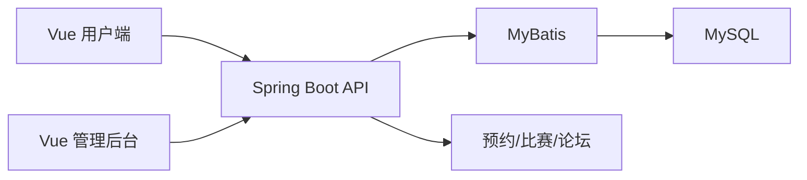

# 018 篮球训练营管理系统 | Basketball Camp

> 用一个全栈后台管理训练营、训练项目、人员、预约、比赛和论坛。
>
> **English:** A practical, runnable project with a documented workflow for the problem described above.

## 项目展示 / Demo

## 解决什么问题 / Problem

解决训练营报名、课程安排、人员信息和比赛内容分散在表格或聊天工具中的问题。

**English:** This project addresses the problem above with a reproducible local workflow.

## 有什么用 / Use

用户端浏览训练内容并预约，管理员在后台维护人员、训练项目、比赛、论坛和上传资料。

**English:** Run the workflow locally, inspect the output, and extend the project from the provided source.

## 高光亮点 / Highlights

- Vue 用户端 + Vue 管理后台
- Spring Boot/MyBatis Java 后端
- MySQL 脚本和文件上传
- 训练营、人员、预约、比赛、论坛业务模块

## 技术名词 / Tech

`Vue · Java 8 · Spring Boot · MyBatis · MySQL`

## 从 ZIP 开始复现 / Reproduce from ZIP

1. 下载 ZIP 并解压。
2. 阅读根目录 README，准备 JDK、Maven、Node.js 和 MySQL。
3. 导入数据库脚本并配置后端数据库连接。
4. 在后端执行 mvn spring-boot:run。
5. 在 front 和 admin 目录分别执行 npm install、npm run dev。

**Expected result:** 后端启动后，用户端和管理端分别打开本地地址；先用演示数据验证预约、训练项目和后台管理。

## 目录提示 / Notes

- 先阅读本 README，再按项目内更详细的中文/英文文档补充配置。
- 不要把真实密码、Token、数据库业务数据和本机运行结果提交回仓库。
- 下载 ZIP 后的第一次运行应使用测试数据或示例图片，确认链路正常后再接入自己的环境。

[English documentation](README.en.md)
